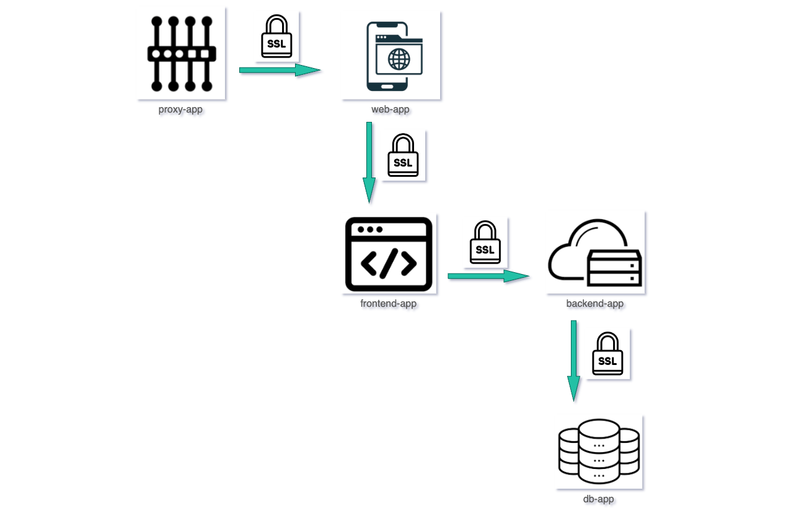

What is k8spacket? 

It is the tool to collect information about TCP traffic and TLS connection metadata in the Kubernetes cluster using eBPF and visualize it in Grafana. 
[View on GitHub](https://github.com/k8spacket)

Use Grafana dashboards below to see how it works
- [k8spacket - node graph]({{TRAFFIC_HOST1_31400}}/d/fdad1ee1-a619-493d-b0ff-2ca2682fdc57/k8spacket-node-graph) - Graph of TCP connections
- [k8spacket - TLS connections & certificates]({{TRAFFIC_HOST1_31400}}/d/_WjaqJt4k/k8spacket-tls-connections-and-certificates) - Table of TLS handshake processes made in the cluster
- [k8spacket - TLS certificate expiration]({{TRAFFIC_HOST1_31400}}/d/a730b0a6-b02e-4c48-957b-dd8174aef06e/k8spacket-tls-certificate-expiration) - Dashboard with the remaining time until the certificates expire
- [k8spacket dashboards]({{TRAFFIC_HOST1_31400}}/dashboards?tag=k8spacket) - k8spacket dashboards list

---
 
 
Test application is deployed in the namespace "example"

See TCP connections on graph [k8spacket - node graph]({{TRAFFIC_HOST1_31400}}/d/fdad1ee1-a619-493d-b0ff-2ca2682fdc57/k8spacket-node-graph?orgId=1&var-statstype=connection&var-namespace=example&var-include=&var-exclude=node%7Csvc%7Cping)
or look for TLS metadata details [k8spacket - TLS connections & certificates]({{TRAFFIC_HOST1_31400}}/d/_WjaqJt4k/k8spacket-tls-connections-and-certificates)

---
 
 

- Other stuff
  - [Prometheus]({{TRAFFIC_HOST1_31401}})
